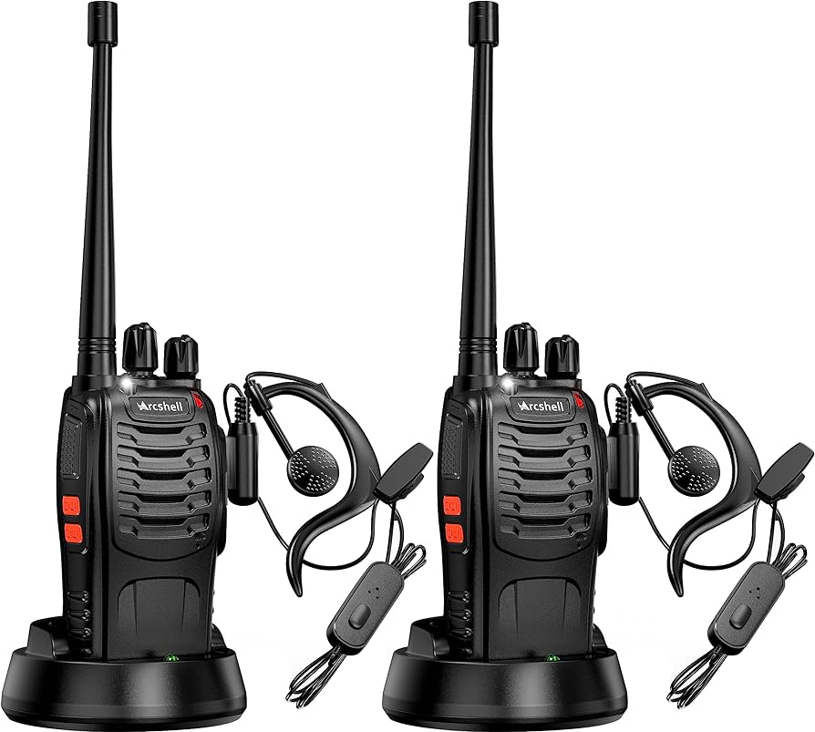
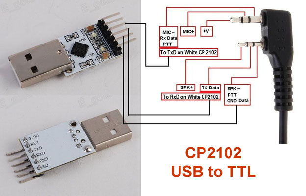

# Arcshell AR-5 / BaoFeng BF-888s Radio Documentation

This repository serves as a comprehensive resource for beginners and enthusiasts who have purchased Arcshell AR-5 radios. Whether you're seeking detailed information or guidance on usage, this repository aims to simplify the learning process by gathering valuable insights, tips, and resources in one place.

Arcshell AR-5 radios are said to be a rebrand of BAOFENG BF-888S radios, so I added it to the title for better search visibility.

Feel free to contribute any valuable information you have to make this repository more helpful for others.

***Disclaimer**: The information provided in this documentation is based on personal research and knowledge gathered from the internet. While efforts have been made to ensure accuracy, I cannot guarantee the completeness or reliability of the information. Users are advised to verify any critical information independently and use it at their own discretion. I assume no responsibility for any legal consequences that may arise from the use of this information.*

## Table of Contents

- [Important Information](#important-information)
- [User's Manual](#users-manual)
- [Default Channel Frequencies](#default-channel-frequencies)
- [FRS Channel Frequencies](#frs-channel-frequencies)
- [DIY Programming Cable](#diy-programming-cable)
- [Programming Software](#programming-software)
- [Use with previous Walkie Talkies](#programming-software)
- [How to Contribute](#how-to-contribute)
- [Feedback and Suggestions](#feedback-and-suggestions)

## Important Information
- **Legal Considerations:** The default channels that come with the radio can clash with federal agencies and can lead to potential legal charges and fines.
- **Channel Usage:** You can safely use the radios within FRS channels without a license.
- **Licensing:** If you are willing to get a license for this radio, a GMRS license costs $35 and covers your entire family.
- **Repeater Usage:** If you have a license, you can find "open" access repeaters in your local area to extend the range of your radios.
- **Repeater Etiquette:** When using a repeater, you must follow the etiquettes.

## User's Manual

If you've misplaced your user's manual, you can find a copy on [FCC Website](https://fcc.report/FCC-ID/2ARTCARAR/5466687.pdf).

## Default Channel Frequencies

Here are the default channel configurations for Arcshell AR-5 radios:

| Loc |   Frequency  | Tone  | ToneSql | DTCS |
|-----|--------------|-------|---------|------|
| 1   | 462.125000   | TSQL  | 69.3    |      |
| 2   | 462.225000   |       |         |      |
| 3   | 462.325000   |       |         |      |
| 4   | 462.425000   | TSQL  | 103.5   |      |
| 5   | 462.525000   | TSQL  | 114.8   |      |
| 6   | 462.625000   | TSQL  | 127.3   |      |
| 7   | 462.725000   | TSQL  | 136.5   |      |
| 8   | 462.825000   | TSQL  | 162.2   |      |
| 9   | 462.925000   | DTCS  |         | 25   |
| 10  | 463.025000   | DTCS  |         | 51   |
| 11  | 463.125000   | DTCS  |         | 125  |
| 12  | 463.225000   | DTCS  |         | 155  |
| 13  | 463.525000   | DTCS  |         | 465  |
| 14  | 450.225000   | DTCS  |         | 23   |
| 15  | 460.325000   |       |         |      |
| 16  | 469.950000   | TSQL  | 203.5   |      |

## FRS Channel Frequencies 

Here are the FRS channel frequencies:

| FRS Channel | Frequency | FRS Power | FRS Bandwidth | GMRS Power | GMRS Bandwidth | Notes/Usage                       |
|-------------|-----------|-----------|---------------|------------|----------------|-----------------------------------|
| 01          | 462.5625  | 2 W       | 12.5 kHz      | 5 W        | 20 kHz         | (1)                               |
| 02          | 462.5875  | 2 W       | 12.5 kHz      | 5 W        | 20 kHz         | (1)                               |
| 03          | 462.6125  | 2 W       | 12.5 kHz      | 5 W        | 20 kHz         | (1)                               |
| 04          | 462.6375  | 2 W       | 12.5 kHz      | 5 W        | 20 kHz         | (1)                               |
| 05          | 462.6625  | 2 W       | 12.5 kHz      | 5 W        | 20 kHz         | (1)                               |
| 06          | 462.6875  | 2 W       | 12.5 kHz      | 5 W        | 20 kHz         | (1)                               |
| 07          | 462.7125  | 2 W       | 12.5 kHz      | 5 W        | 20 kHz         | (1)                               |
| 08          | 467.5625  | 0.5 W     | 12.5 kHz      | 0.5 W      | 12.5 kHz       | (1)                               |
| 09          | 467.5875  | 0.5 W     | 12.5 kHz      | 0.5 W      | 12.5 kHz       | (1)                               |
| 10          | 467.6125  | 0.5 W     | 12.5 kHz      | 0.5 W      | 12.5 kHz       | (1)                               |
| 11          | 467.6375  | 0.5 W     | 12.5 kHz      | 0.5 W      | 12.5 kHz       | (1)                               |
| 12          | 467.6625  | 0.5 W     | 12.5 kHz      | 0.5 W      | 12.5 kHz       | (1)                               |
| 13          | 467.6875  | 0.5 W     | 12.5 kHz      | 0.5 W      | 12.5 kHz       | (1)                               |
| 14          | 467.7125  | 0.5 W     | 12.5 kHz      | 0.5 W      | 12.5 kHz       | (1)                               |
| 15          | 462.5500  | 2 W       | 12.5 kHz      | 50 W       | 20 kHz         | (1) (2)                           |
| 16          | 462.5750  | 2 W       | 12.5 kHz      | 50 W       | 20 kHz         | (1) (2)                           |
| 17          | 462.6000  | 2 W       | 12.5 kHz      | 50 W       | 20 kHz         | (1) (2)                           |
| 18          | 462.6250  | 2 W       | 12.5 kHz      | 50 W       | 20 kHz         | (1) (2)                           |
| 19          | 462.6500  | 2 W       | 12.5 kHz      | 50 W       | 20 kHz         | (1) (2)                           |
| 20          | 462.6750  | 2 W       | 12.5 kHz      | 50 W       | 20 kHz         | (1) (2)                           |
| 21          | 462.7000  | 2 W       | 12.5 kHz      | 50 W       | 20 kHz         | (1) (2)                           |
| 22          | 462.7250  | 2 W       | 12.5 kHz      | 50 W       | 20 kHz         | (1) (2)                           |
|             | 467.5500  |           |               | 50 W       | 20 kHz         | (3)                               |
|             | 467.5750  |           |               | 50 W       | 20 kHz         | (3)                               |
|             | 467.6000  |           |               | 50 W       | 20 kHz         | (3)                               |
|             | 467.6250  |           |               | 50 W       | 20 kHz         | (3)                               |
|             | 467.6500  |           |               | 50 W       | 20 kHz         | (3)                               |
|             | 467.6750  |           |               | 50 W       | 20 kHz         | (3)                               |
|             | 467.7000  |           |               | 50 W       | 20 kHz         | (3)                               |
|             | 467.7250  |           |               | 50 W       | 20 kHz         | (3)                               |

**Notes**

(1) Shared FRS and GMRS simplex.
(2) GMRS repeater output.
(3) GMRS repeater input only.

*Credits: FRS Channel Information sourced from [RadioReference.com](https://wiki.radioreference.com/index.php/FRS/GMRS_combined_channel_chart)*

## DIY Programming Cable

To program your Arcshell AR-5 radios, you'll need a programming cable like this one:

You can either purchase one for [less than $2 from AliExpress](https://www.aliexpress.us/item/3256805744418678.html) or create your own using a USB to Serial FTDI converter. Here's a diagram for the DIY programming cable:

*Credits: Diagram sourced from [Miklor.com](https://www.miklor.com/COM/UV_Technical.php)*

Following is a photo of my DIY USB Radio Programmer:

## Programming Software

Once you have a programming cable, you may download [CHIRP](https://chirpmyradio.com/projects/chirp/wiki/Download) to program your radio. For guidance on using CHIRP, refer to this [YouTube video](https://www.youtube.com/watch?v=XQ_JzivmjyI) from NotaRubicon Productions.

## Use with Walkie Talkies

If you have previously owned other walkie talkies and wish to use them alongside your Arcshell AR-5 radios, you need to ensure compatibility and proper channel settings.

Check the user manual or specifications of your other walkie talkies to verify their frequency bands and supported modes.

***Legal Note:** You still need a license to transmit on FRS frequencies using GMRS radios. Maximum allowed power to transmit on FRS channels without a license is 0.5-2.0W.*

### Usage
This setup is ideal if you intend to distribute radios to your children without concern about them transmitting on frequencies other than FRS. You can provide the walkie talkies to your children while carrying the 'adult radios' yourself.

### Channel Configuration

If your previous Walkie Talkies use FRS channels, you can configure your Arcshell AR-5 radios to use compatible channels. By programming your AR-5 radios to operate on FRS channels, you can effectively communicate with your previous walkie talkies.

Tip: "Channels 15-22, (however,) offer GMRS users the highest power option, so these are preferred for tactical communications." -[CERT-LA](https://www.cert-la.com/downloads/radio/FRS-GMRS-Frequency-Chart.pdf)

### Programming Process

1. Identify the FRS channels used by your walkie talkies. Refer to the user manual or specifications provided with your walkie talkies for this information.

2. Program your Arcshell AR-5 radios to use the same [FRS Channels](#frs-channel-frequencies). Use the programming software and cable mentioned earlier in this documentation to configure the channel settings of your AR-5 radios accordingly.

3. Once programmed, test the communication between your Arcshell AR-5 radios and the walkie talkies.

#### Example Setup

Here's an image of where I setup Arcshell AR-5 radios alongside my existing [Walmart brand walkie talkies](https://www.walmart.com/ip/Onn-23-mile-Walkie-Talkie-3-pack-with-Two-Way-Radios-LED-Light-22-FRS-Channel-Options/1027134774):

*I also named my radios for easy tracking and simply for the fun of it. :wink: If you are wondering where these names came from, they are [traditional Bangladeshi iftar items](https://accordingtoathena.files.wordpress.com/2015/07/fullsizerender-26.jpg). :bangladesh:*

## How to Contribute

Contributions to this documentation repository are highly encouraged! Whether you're a seasoned expert or a fellow beginner, your input is invaluable in enhancing the quality and comprehensiveness of this resource. Please feel free to submit a pull request with any insights, tips, or additional resources.

## Feedback and Suggestions

Your contribution is essential in improving this documentation. If you have any suggestions, feedbacks, and/or encounter any issues, please don't hesitate to open an issue or reach out to me.

Let's work together to make this repository a valuable resource for everyone!
