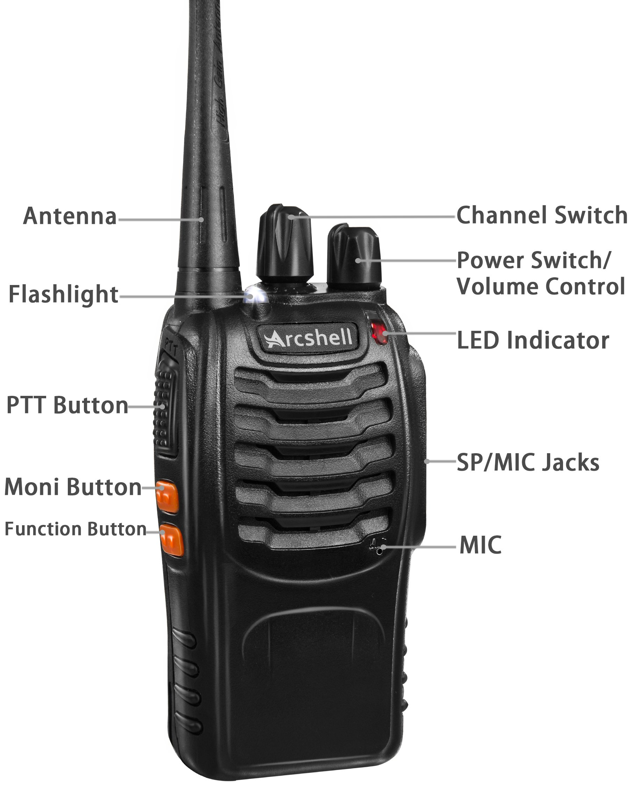

# Arcshell AR-5 / BaoFeng BF-888S / Pxton PX-888S Radio - Complete Guide

> **Comprehensive documentation, programming guides, and resources for Arcshell AR-5, BaoFeng BF-888S, and Pxton PX-888S two-way radios**

## Overview

This repository serves as the definitive resource for Arcshell AR-5, BaoFeng BF-888S, and Pxton PX-888S radio users. These radios are essentially rebranded versions of the same hardware, featuring identical circuitry and functionality. Whether you're a complete beginner or an experienced radio operator, you'll find programming guides, frequency charts, DIY cable schematics, licensing information, and troubleshooting tips.

### Key Features
- 📡 UHF frequency range (400-470 MHz)
- 🔋 1500mAh rechargeable lithium battery
- 📻 16 programmable channels
- 🎯 CTCSS/DCS tone support
- 🔌 USB programming capability
- 💪 Durable construction with belt clip

### ⚠️ Important Legal Disclaimer

**READ THIS FIRST:** The information provided here is based on extensive research and community knowledge. While every effort has been made to ensure accuracy, users must:

- **Verify all information independently before use**
- **Understand that these radios require a valid Amateur Radio (Ham) license to transmit legally in the United States**
- **Be aware that the default programmed frequencies may conflict with federal and emergency service frequencies**
- **Accept full responsibility for compliance with FCC regulations and local laws**
- **Use this information at your own risk and discretion**

Transmitting without proper licensing can result in significant fines (up to $10,000) and legal action from the FCC.

---

## Table of Contents

- [Quick Start Guide](#quick-start-guide)
- [Technical Specifications](#technical-specifications)
- [Important Legal Information](#important-legal-information)
- [Getting Your Ham Radio License](#getting-your-ham-radio-license)
- [User Manual & Documentation](#user-manual--documentation)
- [Programming Your Radio](#programming-your-radio)
  - [Required Equipment](#required-equipment)
  - [DIY Programming Cable](#diy-programming-cable)
  - [CHIRP Software Setup](#chirp-software-setup)
  - [Step-by-Step Programming Guide](#step-by-step-programming-guide)
- [Factory Default CHIRP Images](#factory-default-chirp-images)
- [Frequency Reference](#frequency-reference)
  - [Default Channel Frequencies](#default-channel-frequencies)
  - [FRS/GMRS Channel Chart](#frsgmrs-channel-chart)
- [Using Repeaters](#using-repeaters)
- [Compatibility with Other Radios](#compatibility-with-other-radios)
- [Range & Performance Tips](#range--performance-tips)
- [Troubleshooting](#troubleshooting)
- [Safety & Best Practices](#safety--best-practices)
- [Contributing](#contributing)
- [Resources & Links](#resources--links)

---

## Quick Start Guide

### For Complete Beginners

**⚠️ BEFORE YOU TRANSMIT:** These radios require a license. You can listen (receive) without a license, but transmitting without a valid Amateur Radio license is illegal.

1. **Charge your radios** - Use the included charging cradles for 2-3 hours
2. **Learn to listen** - Turn on the radio, select a channel, and listen only
3. **Get licensed** - [Take the Ham Radio exam](#getting-your-ham-radio-license) (it's easier than you think!)
4. **Program your radio** - Use [CHIRP software](#chirp-software-setup) to configure proper frequencies
5. **Join the community** - Find local repeaters and Ham radio clubs

### Initial Setup Checklist

- [ ] Radio fully charged
- [ ] Read the [user manual](#user-manual--documentation)
- [ ] Understand [legal requirements](#important-legal-information)
- [ ] Obtained programming cable
- [ ] Downloaded [CHIRP software](https://chirpmyradio.com/projects/chirp/wiki/Download)
- [ ] Backed up factory settings
- [ ] Programmed with appropriate frequencies
- [ ] Tested communication on legal frequencies

---

## Technical Specifications

| Specification | Details |
|---------------|--------|
| **Frequency Range** | 400-470 MHz (UHF) |
| **Channel Capacity** | 16 programmable channels |
| **Output Power** | 5W (High) / 0.5W (Low)* |
| **Battery** | 1500mAh Li-ion rechargeable |
| **Battery Life** | 8-12 hours typical use |
| **Antenna** | Fixed rubber duck antenna (SMA) |
| **Modulation** | FM (F3E) |
| **Channel Spacing** | 25 kHz / 12.5 kHz |
| **Privacy Codes** | CTCSS: 50 tones, DCS: 104 codes |
| **Dimensions** | 110 x 54 x 32 mm (approx.) |
| **Weight** | ~200g with battery and antenna |
| **FCC Certification** | Part 90 (Commercial/Business) |
| **Programming** | PC-based via USB cable |
| **Operating Temp** | -20°C to +60°C |

*Note: Actual output power may vary. These radios typically operate at higher power than FRS radios permit (0.5-2W), which is another reason why licensing is required.

### Hardware Compatibility

These radios are hardware-identical across brands:
- **Arcshell AR-5** (most common branding on Amazon)
- **BaoFeng BF-888S** (original manufacturer)
- **Pxton PX-888S** (rebrand)
- Various generic "BF-888S" clones

All share the same:
- Internal circuitry and chipset
- Programming protocol
- Accessories (batteries, chargers, antennas)
- CHIRP configuration files

---

## Important Legal Information

### FCC Certification Status

The Arcshell AR-5 radios are **[FCC Part 90 certified](https://fcc.report/FCC-ID/2ARTCARAR/5466678)**, which means:

- ✅ Approved for **commercial/business band use**
- ✅ Legal for **Amateur Radio (Ham) use** with proper license
- ❌ **NOT certified for FRS** (Family Radio Service)
- ❌ **NOT certified for GMRS** (General Mobile Radio Service)

### What This Means for You

**You MUST have an Amateur Radio (Technician class or higher) license to legally transmit with these radios, regardless of frequency or power level used.**

#### Common Misconceptions (All FALSE):

❌ "I can use FRS channels without a license"  
❌ "It's okay if I stay under 2 watts"  
❌ "No one will notice if I just talk to my family"  
❌ "I can use it like a walkie-talkie for my kids"  

### Why Licensing Matters

1. **Default frequencies interfere with emergency services** - Some factory channels conflict with police, fire, and EMS
2. **FCC actively monitors spectrum** - Violations are investigated and prosecuted
3. **Penalties are severe** - Fines up to $10,000+ and potential criminal charges
4. **It's actually easy to get licensed** - Most people pass with 1-2 weeks of study
5. **License opens up legitimate use** - Access to repeaters, longer range, legal operation

### Legal Alternatives (Without License)

If you need license-free communication:
- **FRS radios** - Buy Part 95 certified radios (max 2W, built-in antenna)
- **CB radios** - Citizens Band (no license required in US)
- **MURS radios** - Multi-Use Radio Service (5 channels, 2W max)

---

## Getting Your Ham Radio License

### Why Get Licensed?

- ✅ Legal operation of your radios
- ✅ Access to thousands of repeaters nationwide
- ✅ Learn proper radio etiquette and procedures
- ✅ Join a community of 750,000+ US hams
- ✅ Emergency communication capabilities
- ✅ Gateway to more advanced radio equipment

### License Details

**Technician Class License** (what you need for these radios):
- Valid for **10 years**
- **One-time exam fee**: $15-35 (varies by testing organization)
- **No renewal fees** (only need to update registration)
- Covers your **entire family** under your callsign for certain uses
- Access to all VHF/UHF frequencies (including those used by these radios)

### How to Get Licensed (Step-by-Step)

#### 1. Study for the Exam

**Free Study Resources:**
- **[HamStudy.org](https://hamstudy.org/)** - Interactive practice exams, tracks progress
- **[HamRadioPrep.com](https://hamradioprep.com/free-ham-radio-practice-tests/)** - Free practice tests with explanations
- **[AA9PW Exam Practice](https://www.aa9pw.com/)** - Simple question drill
- **[KB6NU's Study Guides](https://www.kb6nu.com/study-guides/)** - Free PDF study guides

**Exam Format:**
- 35 multiple choice questions
- 26 correct answers needed to pass (74%)
- Questions pulled from public question pool
- Exam is **open book** for frequency charts

**Study Time:**
- Most people: 1-2 weeks of casual study
- Intensive study: 2-3 days possible
- Average pass rate: ~90%

#### 2. Register for Exam

**Online Options** (take from home):
- **[HamStudy.org/sessions](https://hamstudy.org/sessions)** - Fully online, $15
- **[GLAARG](https://glaarg.org/)** - Greater Los Angeles Amateur Radio Group
- **[ARRL Online Exams](https://www.arrl.org/exam-session-search)** - Search for online sessions

**In-Person Options:**
- **[ARRL Exam Search](https://www.arrl.org/exam-session-search)** - Find local testing
- **[W5YI Exam Locator](https://www.w5yi.org/exam_locations_ama.php)**
- Local Ham radio clubs (often free or low-cost)

#### 3. Take the Exam

**What to Bring (In-Person):**
- Government-issued photo ID
- Exam fee (cash or check, varies by location)
- Pencils/pens
- Calculator (optional, but helpful)

**Online Exam Process:**
- Requires webcam and stable internet
- ID verification required
- Monitored via video during exam
- Immediate results provided

#### 4. Get Your Callsign

- Results submitted to FCC electronically
- Callsign typically issued within 3-5 days
- Check status at **[FCC License Search](https://wireless2.fcc.gov/UlsApp/UlsSearch/searchLicense.jsp)**
- Your license will appear in **[FCC ULS Database](https://www.fcc.gov/uls)**

#### 5. Register with FCC

- Create account at **[FCC CORES](https://apps.fcc.gov/cores/userLogin.do)**
- Link your callsign to your account
- Required for license renewals (free, but must be done)

### After You're Licensed

1. **Program your callsign** - You must identify yourself when transmitting
2. **Find local repeaters** - Use **[RepeaterBook](https://www.repeaterbook.com/)**
3. **Join a club** - Find via **[ARRL Club Search](https://www.arrl.org/find-a-club)**
4. **Learn proper procedures** - "CQ" calls, phonetic alphabet, Q-codes
5. **Get on the air!** - Start making contacts

### License-Free Listening

**You can RECEIVE (listen) without a license:**
- Monitor local repeaters
- Listen to weather stations
- Scan emergency frequencies (listen only!)
- Learn by listening to other operators
- Practice radio etiquette

---

## User Manual & Documentation

### Official Manual

The official Arcshell AR-5 user manual is available from the FCC database:
- **[Download PDF from FCC](https://fcc.report/FCC-ID/2ARTCARAR/5466687.pdf)** (Official source)

This manual covers:
- Basic operation and controls
- LED indicator meanings
- Battery charging procedures
- Channel selection and scanning
- VOX (voice-activated transmission) setup
- Basic troubleshooting

### Manual Applies To

The same manual works for all hardware-identical models:
- Arcshell AR-5
- BaoFeng BF-888S
- Pxton PX-888S
- Generic BF-888S variants

### Quick Reference Guide

**Button Functions:**
- **PTT (Push-To-Talk)**: Side button - Hold to transmit
- **Monitor**: Side button (top) - Override squelch
- **Power/Volume**: Top knob - Rotate to adjust
- **Channel**: Top knob - Short press to change channels
- **LED Indicators**:
  - Green: Receiving signal
  - Red: Transmitting
  - Orange: Low battery
  - Flashing red: Out of range or no signal

---

## Programming Your Radio

### Required Equipment

#### 1. Programming Cable

You need a USB programming cable compatible with BaoFeng BF-888S radios.

**Where to Buy:**
- **[AliExpress](https://www.aliexpress.us/item/3256805744418678.html)** - $1-3 (2-4 week shipping)
- **Amazon** - $8-15 (search "BaoFeng programming cable USB")
- **eBay** - $5-10

**Cable Specifications:**
- Kenwood K1 connector (2-pin)
- USB-to-serial chipset (Prolific PL2303 or CH340)
- Compatible with BF-888S, UV-5R, and similar models

**Important:** Cheap cables often have counterfeit chipsets that require special drivers. See [Troubleshooting](#troubleshooting) if your cable isn't recognized.

#### 2. Computer Requirements

- **Windows**: 7/8/10/11 (most compatible)
- **macOS**: 10.13+ (may require additional drivers)
- **Linux**: Ubuntu 20.04+ or similar (best driver support)
- USB port (USB-C adapters work)

### DIY Programming Cable

If you're comfortable with electronics, you can build your own cable:

*Diagram credit: [Miklor.com](https://www.miklor.com/COM/UV_Technical.php)*

**Required Components:**
- USB-to-TTL serial adapter (CP2102 or FTDI FT232RL)
- Kenwood K1 connector or 2.5mm + 3.5mm audio jacks
- Resistors and capacitors (see diagram)
- Basic soldering skills

**My DIY Build:**

**Advantages of DIY:**
- Better quality components
- No counterfeit driver issues
- Educational experience
- ~$5 in parts if buying in bulk

**Pin Configuration:**
- Pin 1 (outer): Ground
- Pin 2 (inner): Audio (TX/RX)

Detailed wiring instructions and component values are available at [Miklor.com](https://www.miklor.com/COM/UV_Technical.php).

---

### CHIRP Software Setup

**CHIRP** (Computer Hardware Interface for Radio Programming) is the free, open-source standard for programming these radios.

#### Installation

1. **Download CHIRP:**
   - Official site: **[chirpmyradio.com](https://chirpmyradio.com/projects/chirp/wiki/Download)**
   - Choose your operating system version
   - Current version (as of 2026): CHIRP-next (recommended)

2. **Install Drivers:**
   - Windows usually installs automatically
   - If not recognized, download drivers for your cable's chipset:
     - **[Prolific PL2303 Driver](http://www.prolific.com.tw/US/ShowProduct.aspx?p_id=225)**
     - **[CH340 Driver](http://www.wch-ic.com/downloads/CH341SER_EXE.html)**
   - macOS may require manual driver installation

3. **Verify Installation:**
   - Plug in programming cable
   - Check Device Manager (Windows) or System Report (Mac)
   - Should show as "USB-to-Serial" device on a COM port

#### First Time Setup

1. **Connect radio to cable** - Ensure radio is OFF when connecting
2. **Turn radio ON**
3. **Launch CHIRP**
4. **Go to Radio > Download from Radio**
5. **Select:**
   - Port: (your COM port, e.g., COM3)
   - Vendor: Baofeng
   - Model: BF-888S
6. **Click OK** - CHIRP will read current configuration

⚠️ **IMPORTANT:** Always download and save your current configuration before making changes! This creates a backup.

---

### Step-by-Step Programming Guide

#### Beginner-Friendly Programming Process

##### Step 1: Backup Factory Settings

1. Connect radio and launch CHIRP
2. Download current configuration from radio
3. Save as "BF-888S-Factory-Backup.img"
4. Keep this file safe - it's your restore point

##### Step 2: Load a Starter Configuration

Option A: **Use factory defaults** from this repository
- Download from [factory-default-images](#factory-default-chirp-images)
- Open in CHIRP
- Modify as needed

Option B: **Start fresh**
- Create new profile in CHIRP
- Manually enter frequencies

##### Step 3: Configure Channels

**For each channel, set:**

| Field | Description | Example |
|-------|-------------|----------|
| Location | Channel number (1-16) | 1 |
| Frequency | TX/RX frequency in MHz | 146.520 |
| Name | Channel label (up to 6 chars) | CALL |
| Tone Mode | CTCSS/DCS or None | Tone |
| Tone | Privacy code (optional) | 100.0 |
| ToneSql | RX tone (squelch) | 100.0 |
| Duplex | Offset direction | Off / + / - |
| Offset | Repeater shift (MHz) | 0.600 |
| Mode | Modulation (always FM) | FM |
| Power | High (5W) or Low (0.5W) | High |

##### Step 4: Recommended Beginner Channels

Here's a suggested channel setup for new Ham operators:

| Ch | Frequency | Name | Purpose | Tone |
|----|-----------|------|---------|------|
| 1 | 146.520 | CALL | National 2m calling frequency | None |
| 2 | 146.550 | SMPLX | Simplex chat | None |
| 3 | 147.000 | SMPLX | Simplex chat | None |
| 4 | 146.940+ | RPT1 | Local repeater (example) | 100.0 |
| 5 | 147.240+ | RPT2 | Local repeater (example) | 110.9 |
| 6-16 | (varies) | - | Configure per your area | - |

**Find local repeaters:**
- **[RepeaterBook.com](https://www.repeaterbook.com/)** - Worldwide database
- **[ARRL Repeater Directory](https://www.arrl.org/repeater-directory)**
- Local Ham club websites

##### Step 5: Configure Settings

**CHIRP Settings Tab:**
- **Squelch**: 5-7 (adjust based on noise)
- **VOX**: Off (or 1-9 if using hands-free)
- **TOT (Time-Out Timer)**: 60 seconds
- **BCL (Busy Channel Lockout)**: On
- **Save Mode**: On (battery saver)
- **Beep**: On (confirms button presses)

##### Step 6: Upload to Radio

1. Review all channel entries
2. Go to **Radio > Upload to Radio**
3. Confirm COM port and model
4. Click **OK**
5. Wait for completion (30-60 seconds)
6. Radio will beep when done

##### Step 7: Test Your Programming

1. Cycle through channels and verify names appear
2. Monitor each channel briefly
3. Test transmit (legally, with license) on simplex channel
4. Verify tones are working on repeater channels

---

### Advanced CHIRP Tips

**Keyboard Shortcuts:**
- `Ctrl+C` / `Ctrl+V`: Copy/paste rows
- `Ctrl+Z`: Undo
- `Insert`: Add new channel
- `Delete`: Remove channel

**Bulk Editing:**
- Select multiple channels (Shift+Click or Ctrl+Click)
- Right-click > Edit > Set values for all selected

**Import/Export:**
- File > Export > CSV (share with others)
- File > Import > CSV (load from others)

**Templates:**
- Save common configs as .img files
- Quick-load for different use cases (camping, emergency, events)

---

## Factory Default CHIRP Images

Factory-fresh CHIRP configuration files are available in this repository:

### Available Images

- **[Arcshell AR-5 - Factory Default.img](factory-default-images/Arcshell-AR-5-FactoryDefault.img)**
- **[BaoFeng BF-888S - Factory Default.img](factory-default-images/Baofeng-BF-888s-FactoryDefault.img)**
- **[Pxton PX-888S - Factory Default.img](factory-default-images/Pxton-PX-888s-FactoryDefault.img)**

### How to Use

1. **Download** the appropriate .img file
2. **Open in CHIRP**: File > Open
3. **Review channels** before uploading
4. **Upload to radio**: Radio > Upload to Radio

### ⚠️ Warning About Factory Settings

**DO NOT TRANSMIT on factory default channels!** Many conflict with:
- Emergency services
- Business radio bands
- Federal government frequencies
- Other licensed services

These files are provided for:
- ✅ Restoring radios to original state
- ✅ Reference for factory configuration
- ✅ Starting point for custom programming

**Always reprogram with appropriate Amateur Radio frequencies before transmitting.**

---

## Frequency Reference

### Default Channel Frequencies

**⚠️ WARNING: DO NOT TRANSMIT ON THESE FREQUENCIES WITHOUT PROPER AUTHORIZATION**

These are the factory-programmed channels. Many are **illegal** for Ham use:

| Ch | Frequency (MHz) | Tone Mode | Tone/DCS | Notes |
|----|-----------------|-----------|----------|-------|
| 1 | 462.125 | TSQL | 69.3 Hz | ⚠️ GMRS (needs GMRS license) |
| 2 | 462.225 | None | - | ⚠️ GMRS |
| 3 | 462.325 | None | - | ⚠️ GMRS |
| 4 | 462.425 | TSQL | 103.5 Hz | ⚠️ GMRS |
| 5 | 462.525 | TSQL | 114.8 Hz | ⚠️ GMRS |
| 6 | 462.625 | TSQL | 127.3 Hz | ⚠️ GMRS |
| 7 | 462.725 | TSQL | 136.5 Hz | ⚠️ GMRS |
| 8 | 462.825 | TSQL | 162.2 Hz | ⚠️ GMRS |
| 9 | 462.925 | DTCS | 025 | ⚠️ GMRS |
| 10 | 463.025 | DTCS | 051 | ⚠️ GMRS |
| 11 | 463.125 | DTCS | 125 | ⚠️ GMRS |
| 12 | 463.225 | DTCS | 155 | ⚠️ GMRS |
| 13 | 463.525 | DTCS | 465 | ⚠️ GMRS |
| 14 | 450.225 | DTCS | 023 | ⚠️ Business band |
| 15 | 460.325 | None | - | ⚠️ Business band |
| 16 | 469.950 | TSQL | 203.5 Hz | ⚠️ Business band |

**Why These Are Problematic:**
- Channels 1-13: GMRS frequencies (require GMRS license, Part 95 certification)
- Channels 14-16: Business/commercial bands (require specific commercial licenses)
- These radios are Part 90 certified, not Part 95 (GMRS)

**Bottom Line:** Reprogram before use!

---

### FRS/GMRS Channel Chart

**Educational Reference Only** - These radios are NOT legal for FRS or GMRS use due to Part 90 (not Part 95) certification.

Standard FRS/GMRS frequency allocations:

| Channel | Frequency (MHz) | FRS Power | GMRS Power | Bandwidth | Type |
|---------|-----------------|-----------|------------|-----------|------|
| 1 | 462.5625 | 2W | 5W | 12.5/20 kHz | Shared |
| 2 | 462.5875 | 2W | 5W | 12.5/20 kHz | Shared |
| 3 | 462.6125 | 2W | 5W | 12.5/20 kHz | Shared |
| 4 | 462.6375 | 2W | 5W | 12.5/20 kHz | Shared |
| 5 | 462.6625 | 2W | 5W | 12.5/20 kHz | Shared |
| 6 | 462.6875 | 2W | 5W | 12.5/20 kHz | Shared |
| 7 | 462.7125 | 2W | 5W | 12.5/20 kHz | Shared |
| 8 | 467.5625 | 0.5W | 0.5W | 12.5 kHz | Shared |
| 9 | 467.5875 | 0.5W | 0.5W | 12.5 kHz | Shared |
| 10 | 467.6125 | 0.5W | 0.5W | 12.5 kHz | Shared |
| 11 | 467.6375 | 0.5W | 0.5W | 12.5 kHz | Shared |
| 12 | 467.6625 | 0.5W | 0.5W | 12.5 kHz | Shared |
| 13 | 467.6875 | 0.5W | 0.5W | 12.5 kHz | Shared |
| 14 | 467.7125 | 0.5W | 0.5W | 12.5 kHz | Shared |
| 15 | 462.5500 | 2W | 50W | 12.5/20 kHz | Repeater output |
| 16 | 462.5750 | 2W | 50W | 12.5/20 kHz | Repeater output |
| 17 | 462.6000 | 2W | 50W | 12.5/20 kHz | Repeater output |
| 18 | 462.6250 | 2W | 50W | 12.5/20 kHz | Repeater output |
| 19 | 462.6500 | 2W | 50W | 12.5/20 kHz | Repeater output |
| 20 | 462.6750 | 2W | 50W | 12.5/20 kHz | Repeater output |
| 21 | 462.7000 | 2W | 50W | 12.5/20 kHz | Repeater output |
| 22 | 462.7250 | 2W | 50W | 12.5/20 kHz | Repeater output |
| - | 467.5500 | - | 50W | 20 kHz | GMRS repeater input |
| - | 467.5750 | - | 50W | 20 kHz | GMRS repeater input |
| - | 467.6000 | - | 50W | 20 kHz | GMRS repeater input |
| - | 467.6250 | - | 50W | 20 kHz | GMRS repeater input |
| - | 467.6500 | - | 50W | 20 kHz | GMRS repeater input |
| - | 467.6750 | - | 50W | 20 kHz | GMRS repeater input |
| - | 467.7000 | - | 50W | 20 kHz | GMRS repeater input |
| - | 467.7250 | - | 50W | 20 kHz | GMRS repeater input |

**Notes:**
- "Shared" = Both FRS and GMRS users can transmit
- Channels 15-22: GMRS repeater capable (higher power)
- These radios exceed FRS power limits and lack fixed antennas
- **Reminder:** Part 90 certification ≠ legal for FRS/GMRS

*Reference source: [RadioReference.com FRS/GMRS Chart](https://wiki.radioreference.com/index.php/FRS/GMRS_combined_channel_chart)*

---

### Amateur Radio Frequency Bands (Legal for These Radios)

With a Technician license, you can use these UHF Ham bands:

#### 70cm Band (440-450 MHz)

**Common Uses:**
- Simplex communication
- Repeater access (most popular)
- Satellite communication
- Digital modes (DMR, D-STAR, Fusion)

**Popular Frequencies:**
- **446.000 MHz**: National simplex calling frequency
- **441.000-445.000 MHz**: Repeater inputs (varies by region)
- **446.000-447.000 MHz**: Simplex operations

**Repeater Splits:**
- Standard offset: +5 MHz or -5 MHz
- Example: 442.500 MHz input / 447.500 MHz output

#### 33cm Band (902-928 MHz)

- Less common but available
- Higher path loss than 70cm
- Good for short-range, high-bandwidth

#### Finding Legal Frequencies

1. **[ARRL Band Plan](http://www.arrl.org/band-plan)** - Official frequency allocations
2. **[RepeaterBook](https://www.repeaterbook.com/)** - Local repeater directory
3. **Local Ham club** - Area-specific recommendations
4. **[ARRL Repeater Directory](https://www.arrl.org/repeater-directory)**

---

## Using Repeaters

### What is a Repeater?

A **repeater** is a station that receives weak signals and retransmits them at higher power, dramatically extending communication range.

**How It Works:**
1. You transmit on the **input frequency** (e.g., 442.500 MHz)
2. Repeater receives your signal
3. Repeater simultaneously transmits on **output frequency** (e.g., 447.500 MHz)
4. Others hear you on the output frequency

**Benefits:**
- 10-50 mile range (vs 1-3 miles simplex)
- Elevated antenna location
- Higher power transmission
- Community access

### Finding Repeaters

**Online Directories:**
- **[RepeaterBook.com](https://www.repeaterbook.com/)** - Most comprehensive, mobile apps available
- **[ARRL Repeater Directory](https://www.arrl.org/repeater-directory)** - Official ARRL listing
- **[RadioReference.com](https://www.radioreference.com/)** - Detailed database

**Search by:**
- Location (city, ZIP code, coordinates)
- Distance from your position
- Band (70cm, 2m, etc.)
- Features (IRLP, EchoLink, APRS)

### Programming Repeaters in CHIRP

**Required Information:**
- Output frequency (what you listen to)
- Input offset (+ or -, typically ±5 MHz for 70cm)
- Tone/CTCSS (if required)

**Example: Programming a 70cm repeater**

| Field | Value | Explanation |
|-------|-------|-------------|
| Frequency | 447.500 | Repeater output (listen) |
| Duplex | - | Minus offset |
| Offset | 5.000 | 5 MHz shift |
| Tone Mode | Tone | CTCSS encode |
| Tone | 100.0 | Repeater access tone |
| Name | W7XYZ | Repeater callsign |

**Result:**
- You transmit on: 442.500 MHz with 100 Hz tone
- You receive on: 447.500 MHz

### Repeater Etiquette

**Essential Rules:**

1. **Identify Yourself**
   - Give your callsign at least every 10 minutes
   - Start and end of transmission: "W1XYZ clear"

2. **Wait for Break**
   - Don't interrupt ongoing conversations
   - Listen for "any traffic?" or break opportunities

3. **Keep It Short**
   - Repeaters may have time-out timers (60-180 seconds)
   - Allow pauses for others to join

4. **Use Courtesy Tones**
   - Wait for beep before transmitting
   - Indicates repeater is ready

5. **Learn Calling Procedures**
   - "W1XYZ monitoring" (you're listening)
   - "Any station, this is W1XYZ" (calling CQ)
   - "W1XYZ for W2ABC" (directed call)

6. **Emergency Priority**
   - If someone says "Break Break Break" - stop immediately
   - Emergency traffic has absolute priority

### Repeater Access Modes

**Open Repeaters:**
- Anyone with license can use
- Most common type
- May have usage guidelines

**Closed Repeaters:**
- Require permission/membership
- May need special access tone
- Club or private ownership

**Linked Repeaters:**
- Connected to other repeaters
- Regional or national networks
- Examples: IRLP, EchoLink, AllStarLink

### Testing Repeater Access

1. **Program frequency correctly** in CHIRP
2. **Listen first** - ensure repeater is active
3. **Key up briefly** - just say your callsign
4. **Listen for response** - repeater will echo or others respond
5. **If no response** - check tone, offset, or try different repeater

---

## Compatibility with Other Radios

### Using AR-5 with FRS Walkie-Talkies

**Scenario:** You want AR-5 radios to communicate with cheaper FRS walkie-talkies (like kids' toys or basic consumer models).

**Technical Compatibility:**
- ✅ Same frequencies (462-467 MHz)
- ✅ FM modulation (compatible)
- ✅ Can program matching channels
- ❌ Still need license for AR-5 to transmit

**How to Setup:**

1. **Identify FRS radio channels**
   - Check manual for channel-to-frequency chart
   - Most FRS radios use channels 1-22 (see [FRS chart](#frsgmrs-channel-chart))

2. **Program AR-5 to match**
   - Enter exact FRS frequencies in CHIRP
   - Match privacy codes (CTCSS/DCS) if used
   - Set power to LOW (0.5W) if possible

3. **Test communication**
   - AR-5 can receive FRS transmissions (legal)
   - AR-5 transmitting still requires Ham license

**Example Configuration:**

If your FRS radios are on "Channel 7":
- Frequency: 462.7125 MHz
- Program AR-5 to this frequency
- Both radios can now communicate

### Example: Walmart Onn Walkie-Talkies

*My personal setup showing Arcshell AR-5 radios alongside [Walmart Onn brand FRS walkie-talkies](https://www.walmart.com/ip/Onn-23-mile-Walkie-Talkie-3-pack-with-Two-Way-Radios-LED-Light-22-FRS-Channel-Options/1027134774).*

**Setup Notes:**
- Named radios for fun: Traditional Bangladeshi iftar items 🇧🇩
  - [Reference image](https://accordingtoathena.files.wordpress.com/2015/07/fullsizerender-26.jpg)
- FRS radios for kids (no license issues)
- AR-5 for adults (with Ham license)
- Programmed to common FRS frequencies

### Compatible Radio Types

**Can communicate with (after programming):**

✅ **Other BF-888S variants** - Identical hardware  
✅ **FRS radios** - Matching frequencies (license still required)  
✅ **GMRS radios** - Matching frequencies (wrong cert, but technically works)  
✅ **Other Ham radios** - Any UHF-capable Ham radio  
✅ **Commercial Part 90 radios** - Business radios on same frequencies  
✅ **Analog scanners** - For receive only  

**Cannot communicate with:**

❌ **Digital radios** (DMR, D-STAR, Fusion) - Analog only  
❌ **Different bands** (CB, VHF marine, etc.) - Wrong frequencies  
❌ **Encrypted radios** - No encryption support  

### Privacy Codes (CTCSS/DCS)

To match other radios using "privacy codes":

**CTCSS (Continuous Tone-Coded Squelch System):**
- Also called PL tones
- 50 standard tones (67.0-254.1 Hz)
- Must match exactly on both radios

**DCS (Digital-Coded Squelch):**
- 104 digital codes
- More selective than CTCSS
- Format: D023N, D047I, etc.

**Programming in CHIRP:**
- "Tone Mode": Select Tone, TSQL, or DTCS
- "Tone": Transmit code
- "ToneSql": Receive code (squelch)

**FRS Privacy Code Chart:**

Most FRS radios label codes 1-38:

| Code # | CTCSS (Hz) | Code # | CTCSS (Hz) |
|--------|-----------|--------|------------|
| 1 | 67.0 | 20 | 162.2 |
| 2 | 71.9 | 21 | 167.9 |
| 3 | 74.4 | 22 | 173.8 |
| 4 | 77.0 | 23 | 179.9 |
| 5 | 79.7 | 24 | 186.2 |
| 6 | 82.5 | 25 | 192.8 |
| 7 | 85.4 | 26 | 203.5 |
| 8 | 88.5 | 27 | 210.7 |
| 9 | 91.5 | 28 | 218.1 |
| 10 | 94.8 | 29 | 225.7 |
| 11 | 97.4 | 30 | 233.6 |
| 12 | 100.0 | 31 | 241.8 |
| 13 | 103.5 | 32 | 250.3 |
| 14 | 107.2 | 33-38 | DCS codes |
| 15 | 110.9 | | |

---

## Range & Performance Tips

### Expected Range

**Realistic Expectations:**

- **Line-of-sight, flat terrain**: 1-3 miles
- **Urban/suburban areas**: 0.5-1.5 miles
- **Through buildings**: 0.25-0.5 miles
- **With repeater**: 10-50+ miles
- **Hilltop to hilltop**: 5-10 miles

**Factors Affecting Range:**

❌ **Reduces Range:**
- Buildings and structures
- Trees and foliage
- Hills and terrain
- Low battery
- Indoor use
- Low power mode
- Poor antenna

✅ **Increases Range:**
- Height advantage (both stations)
- Clear line-of-sight
- Full battery charge
- High power mode
- Better antenna
- Repeater access
- Open terrain

### Improving Range

#### 1. Antenna Upgrades

The factory rubber duck antenna is mediocre. Better options:

**Replacement Antennas:**
- **Nagoya NA-771** (~$8-12) - Significant improvement, flexible
- **Nagoya NA-701** (~$6-10) - Shorter, more durable
- **Abbree Foldable** (~$12-15) - Tactical, flexible
- **Diamond SRH-805S** (~$20-30) - Longest, best gain

⚠️ **Antenna Warning:** Buy from reputable sellers! Many cheap antennas on Amazon/eBay are counterfeit and perform worse than stock.

**Gain vs Length:**
- Longer antenna = more gain = better range
- But: Less convenient to carry
- Compromise: Medium-length (~7 inches)

#### 2. Optimal Positioning

**Best Practices:**
- Hold radio vertically (antenna upright)
- Elevate: Stand on hill, roof, upper floor
- Avoid metal structures nearby
- Keep antenna away from body when transmitting
- Don't touch antenna during use

**Antenna Polarization:**
- Both stations should be vertical
- Horizontal antenna = ~20 dB loss!

#### 3. Power Management

**High vs Low Power:**
- High (5W): Default for best range
- Low (0.5W): Battery saver, close range

**Programming Power in CHIRP:**
- Set per-channel in "Power" column
- Use Low for known close contacts
- Use High for repeaters or distance

#### 4. Environmental Considerations

**Best Conditions:**
- Early morning (less RF noise)
- Clear weather
- Low humidity
- Open terrain

**Worst Conditions:**
- Storms (lightning risk + noise)
- Dense urban areas
- Inside vehicles (shielded)
- Underground or basements

### Battery Life Optimization

**Maximizing Runtime:**

1. **Enable battery saver** - Radio enters low-power mode when idle
2. **Use low power when possible** - 0.5W uses significantly less
3. **Turn off when not needed** - Obvious but often forgotten
4. **Reduce volume** - Speaker uses power
5. **Disable VOX** - Continuously monitors audio
6. **Minimize transmissions** - RX uses less than TX

**Battery Life Estimates:**
- **Standby (battery saver on)**: 10-12 hours
- **50% RX / 5% TX / 45% standby**: 8-10 hours
- **Heavy use (frequent TX)**: 6-8 hours
- **Continuous RX**: ~8 hours

**Spare Batteries:**
- Keep charged spare (factory or aftermarket)
- Aftermarket batteries: $10-15 on Amazon
- Higher capacity options available (2000-3000mAh)

---

## Troubleshooting

### Common Issues & Solutions

#### Radio Won't Turn On

**Symptoms:** No power, no LED, no sound

**Solutions:**
1. **Charge battery** - Use original charger, 3+ hours
2. **Check battery contacts** - Clean with alcohol, ensure proper seating
3. **Try different battery** - Battery may be dead/faulty
4. **Inspect charging contacts** - Bent pins prevent charging
5. **Test charger LED** - Should show red (charging) or green (complete)

#### Can't Hear Anything

**Symptoms:** Radio on, but silent even on active channels

**Solutions:**
1. **Check volume** - Turn knob clockwise
2. **Disable squelch** - Hold Monitor button to hear static
3. **Verify frequency** - Ensure programmed to active channel
4. **Check tone settings** - CTCSS/DCS may be filtering signals
5. **Antenna connection** - Ensure tight, not cross-threaded
6. **Try different channel** - Current channel may be empty

#### Can't Transmit / Others Can't Hear Me

**Symptoms:** You can hear others, but they don't hear you

**Solutions:**
1. **Hold PTT fully** - Press firmly while talking
2. **Wait for courtesy tone** - On repeaters, wait for beep
3. **Check power setting** - Ensure High power for distance
4. **Verify frequency** - Must match others' RX frequency
5. **Test on different channel** - May be repeater issue
6. **Check offset direction** - +/- must be correct for repeaters
7. **Verify tone** - Must match repeater input tone
8. **Distance too far** - Try closer or higher location

#### Programming Cable Not Recognized

**Symptoms:** CHIRP can't find radio, COM port missing

**Solutions:**
1. **Install drivers** - Download for your cable chipset
   - [Prolific PL2303](http://www.prolific.com.tw/US/ShowProduct.aspx?p_id=225)
   - [CH340](http://www.wch-ic.com/downloads/CH341SER_EXE.html)
2. **Try different USB port** - Some ports have better compatibility
3. **Check Device Manager** - Look for yellow exclamation marks
4. **Radio must be ON** - Turn on before connecting
5. **Reseat connectors** - Unplug and reconnect firmly
6. **Windows only: Driver signature enforcement**
   - Disable for counterfeit Prolific chips
7. **Try different computer** - Rule out PC-specific issues

#### CHIRP Won't Download from Radio

**Symptoms:** "Radio did not respond" or timeout error

**Solutions:**
1. **Select correct model** - Must be "BF-888S" in CHIRP
2. **Verify COM port** - Check Device Manager for port number
3. **Close other programs** - Other software may lock COM port
4. **Radio must be on** - Turn on, wait 5 seconds
5. **Try different cable** - Cable may be faulty
6. **Update CHIRP** - Use latest version
7. **Slower connection** - Some PCs need USB 2.0 (not 3.0)

#### Static / Interference

**Symptoms:** Excessive noise, broken audio, interference

**Solutions:**
1. **Adjust squelch** - Increase to filter noise
2. **Move location** - Away from electrical interference
3. **Check antenna** - Loose connection causes noise
4. **Use tone squelch** - CTCSS filters unwanted signals
5. **Try different frequency** - Current channel may be noisy
6. **Avoid power sources** - Distance from AC adapters, chargers

#### Low Range / Weak Signal

**Symptoms:** Can't reach expected distance, others report weak signal

**Solutions:**
1. **Check antenna** - Ensure tight connection, consider upgrade
2. **Increase power** - Switch to High power mode
3. **Gain altitude** - Higher location dramatically helps
4. **Check battery** - Low battery reduces TX power
5. **Verify frequency** - Ensure both radios match
6. **Use repeater** - Extends range 10-50 miles
7. **Reduce obstacles** - Line-of-sight is critical

#### Radio Beeps / Won't Transmit

**Symptoms:** Error beep when pressing PTT, no transmission

**Solutions:**
1. **Busy channel lockout** - Someone else is transmitting, wait
2. **Time-out timer** - You talked too long, release PTT
3. **Programming error** - Check CHIRP settings
4. **Tone mismatch** - Repeater may require specific tone

---

## Safety & Best Practices

### Operational Safety

#### RF Exposure

**5 Watts is Safe, But:**
- Don't transmit with antenna touching body
- Keep antenna 1-2 inches from head when possible
- Don't transmit continuously for extended periods
- Use headset/speaker mic for prolonged operations

**Children:**
- Supervise young children with radios
- Teach proper antenna safety
- Consider lower power settings

#### Battery Safety

**Lithium Battery Precautions:**
- ⚠️ Don't puncture or disassemble batteries
- ⚠️ Don't expose to extreme heat (>60°C / 140°F)
- ⚠️ Don't short-circuit terminals
- ✅ Use only approved chargers
- ✅ Store at room temperature
- ✅ Inspect for swelling or damage

**Disposal:**
- Recycle lithium batteries properly
- Don't throw in regular trash
- Find local electronics recycling center

#### Emergency Use

**In Emergencies:**
1. **Monitor 146.520 MHz** - National calling frequency
2. **State your situation clearly** - "This is an emergency"
3. **Give location** - GPS coordinates if possible
4. **Unlicensed OK in life-threatening emergency** - FCC allows
5. **Contact 911 via phone first** - Radio is backup

### Operating Best Practices

#### Radio Etiquette

**Do:**
- ✅ Identify with your callsign regularly
- ✅ Listen before transmitting
- ✅ Keep transmissions brief
- ✅ Use plain language
- ✅ Be courteous and respectful
- ✅ Allow breaks for others to join

**Don't:**
- ❌ Interrupt ongoing conversations
- ❌ Use profanity or obscenity
- ❌ Transmit music or entertainment
- ❌ Conduct business transactions
- ❌ Use excessive power for distance
- ❌ Encrypt or obscure messages

#### Phonetic Alphabet

Use for spelling difficult words or callsigns:

| Letter | Phonetic | Letter | Phonetic |
|--------|----------|--------|----------|
| A | Alpha | N | November |
| B | Bravo | O | Oscar |
| C | Charlie | P | Papa |
| D | Delta | Q | Quebec |
| E | Echo | R | Romeo |
| F | Foxtrot | S | Sierra |
| G | Golf | T | Tango |
| H | Hotel | U | Uniform |
| I | India | V | Victor |
| J | Juliett | W | Whiskey |
| K | Kilo | X | X-ray |
| L | Lima | Y | Yankee |
| M | Mike | Z | Zulu |

**Example:** "W1ABC" = "Whiskey One Alpha Bravo Charlie"

#### Common Q-Codes

Short codes for common phrases:

- **QRM** - Interference from other stations
- **QRN** - Static or atmospheric noise
- **QRP** - Low power operation
- **QRS** - Send more slowly
- **QRT** - Stop transmitting
- **QRZ** - Who is calling me?
- **QSL** - I confirm / acknowledgment
- **QSY** - Change frequency
- **QTH** - Location

**Example:** "QRM here, QSY to 146.55?"
(Translation: "Interference here, move to 146.55?")

### Maintenance

#### Regular Care

**Daily:**
- Wipe down exterior with dry cloth
- Check antenna tightness
- Verify battery charge level

**Weekly (heavy use):**
- Clean speaker grill with soft brush
- Inspect battery contacts
- Check for firmware updates (if applicable)

**Monthly:**
- Deep clean with isopropyl alcohol (avoid screen)
- Test all channels and functions
- Verify programming accuracy
- Charge spare batteries

#### Storage

**Short-term (1-4 weeks):**
- Charge to ~50-70%
- Store at room temperature
- Keep away from moisture

**Long-term (months):**
- Remove battery
- Store battery separately at 40-60% charge
- Keep in anti-static bag or case
- Recharge every 3-6 months

---

## Contributing

This repository thrives on community contributions! Whether you're an expert or beginner, your input helps everyone.

### How to Contribute

#### 1. Report Issues

**Found a mistake?** Open an issue:
- Describe the error clearly
- Provide correct information if known
- Include source/reference

#### 2. Suggest Improvements

**Have ideas?** Submit suggestions:
- New sections or topics
- Better explanations
- Additional resources
- Programming templates

#### 3. Submit Pull Requests

**Ready to contribute?** Fork and PR:

1. Fork this repository
2. Create feature branch (`git checkout -b feature/improvement`)
3. Make your changes
4. Test accuracy and formatting
5. Commit with clear message
6. Push to branch
7. Open Pull Request with description

#### 4. Share Configurations

**Have useful CHIRP configs?**
- Local repeater setups
- Emergency frequency templates
- Regional channel plans
- Submit as .img or .csv files

#### 5. Add Photos/Diagrams

**Visual learner?** Contribute:
- Setup photos
- Wiring diagrams
- Comparison images
- Troubleshooting visuals

### Contribution Guidelines

**Quality Standards:**
- ✅ Accurate and verified information
- ✅ Clear, beginner-friendly language
- ✅ Proper formatting (Markdown)
- ✅ Include sources/references
- ✅ Test before submitting (for configs)

**What We're Looking For:**
- Regional repeater information
- Advanced programming guides
- Antenna comparisons/reviews
- Troubleshooting solutions
- International usage guides
- Accessory recommendations

---

## Resources & Links

### Official Documentation
- [Arcshell AR-5 Manual (FCC)](https://fcc.report/FCC-ID/2ARTCARAR/5466687.pdf)
- [FCC Equipment Authorization](https://fcc.report/FCC-ID/2ARTCARAR/5466678)

### Software & Tools
- [CHIRP Radio Programmer](https://chirpmyradio.com/projects/chirp/wiki/Download)
- [Prolific Driver](http://www.prolific.com.tw/US/ShowProduct.aspx?p_id=225)
- [CH340 Driver](http://www.wch-ic.com/downloads/CH341SER_EXE.html)

### Licensing Resources
- [HamStudy.org](https://hamstudy.org/) - Free practice exams
- [HamRadioPrep.com](https://hamradioprep.com/) - Video courses
- [HamExam.org](https://hamexam.org/) - Online testing
- [ARRL Exam Search](https://www.arrl.org/exam-session-search) - Find local testing
- [FCC License Search](https://wireless2.fcc.gov/UlsApp/UlsSearch/searchLicense.jsp)

### Repeater Directories
- [RepeaterBook.com](https://www.repeaterbook.com/) - Worldwide database + apps
- [ARRL Repeater Directory](https://www.arrl.org/repeater-directory)
- [RadioReference.com](https://www.radioreference.com/) - Frequencies + trunking

### Learning Resources
- [ARRL Getting Started](https://www.arrl.org/getting-started) - Beginner guides
- [KB6NU's Blog](https://www.kb6nu.com/) - Ham radio articles
- [Ham Radio Crash Course (YouTube)](https://www.youtube.com/@HamRadioCrashCourse) - Video tutorials
- [NotaRubicon Productions (YouTube)](https://www.youtube.com/@NotaRubicon) - CHIRP tutorials

### Technical References
- [Miklor.com](https://www.miklor.com/) - BaoFeng technical info
- [RadioReference Wiki](https://wiki.radioreference.com/) - Frequency info
- [ARRL Band Plans](http://www.arrl.org/band-plan) - Frequency allocations
- [FCC Part 97 Rules](https://www.ecfr.gov/current/title-47/chapter-I/subchapter-D/part-97) - Amateur Radio regulations

### Shopping Resources
- [AliExpress](https://www.aliexpress.com/) - Cheap accessories (long shipping)
- [Amazon](https://www.amazon.com/) - Fast shipping, higher prices
- [HRO (Ham Radio Outlet)](https://www.hamradio.com/) - Legitimate Ham gear
- [DX Engineering](https://www.dxengineering.com/) - Quality equipment

### Community
- [Reddit r/amateurradio](https://www.reddit.com/r/amateurradio/) - Active community
- [Reddit r/Baofeng](https://www.reddit.com/r/Baofeng/) - Specific to these radios
- [ARRL](https://www.arrl.org/) - National Amateur Radio Association
- [Find a Ham Club](https://www.arrl.org/find-a-club) - Local groups

---

## Feedback and Support

### Get Help

**Issue Tracker:**  
Problems or questions? [Open an issue](https://github.com/sharf-shawon/arcshell-ar5-baofeng-bf-888s/issues)

**Discussions:**  
General chat, tips, and questions: [GitHub Discussions](https://github.com/sharf-shawon/arcshell-ar5-baofeng-bf-888s/discussions)

### Contact

**Repository Maintainer:** [@sharf-shawon](https://github.com/sharf-shawon)

Feel free to reach out with:
- Corrections or improvements
- Content suggestions
- Collaboration opportunities
- General questions

---

## License

This documentation is released under the [Apache License 2.0](LICENSE).

Feel free to:
- Share and distribute
- Modify and adapt
- Use commercially
- Use privately

With attribution to this repository.

---

## Acknowledgments

**Thanks to:**
- The Ham radio community for knowledge sharing
- [Miklor.com](https://www.miklor.com/) for technical diagrams
- [RadioReference.com](https://www.radioreference.com/) for frequency data
- [CHIRP developers](https://chirpmyradio.com/) for excellent software
- All contributors to this repository

**Special Recognition:**
- ARRL for promoting Amateur Radio
- FCC for maintaining open spectrum
- Open-source community for making this possible

---

## Keywords for Search

*Arcshell AR-5, BaoFeng BF-888S, Pxton PX-888S, two-way radio, walkie talkie, Ham radio, Amateur radio, FCC Part 90, CHIRP programming, UHF radio, 16 channel radio, radio programming cable, CTCSS DCS, repeater programming, beginner ham radio, technician license, radio frequencies, FRS GMRS, radio tutorial, BaoFeng programming, DIY programming cable, CHIRP software guide, radio troubleshooting, handheld transceiver, VHF UHF radio*

---

**📻 Happy Operating! 73 (Best Regards) 📻**

*This repository is maintained by the community, for the community.*

[⬆ Back to Top](#arcshell-ar-5--baofeng-bf-888s--pxton-px-888s-radio---complete-guide)

