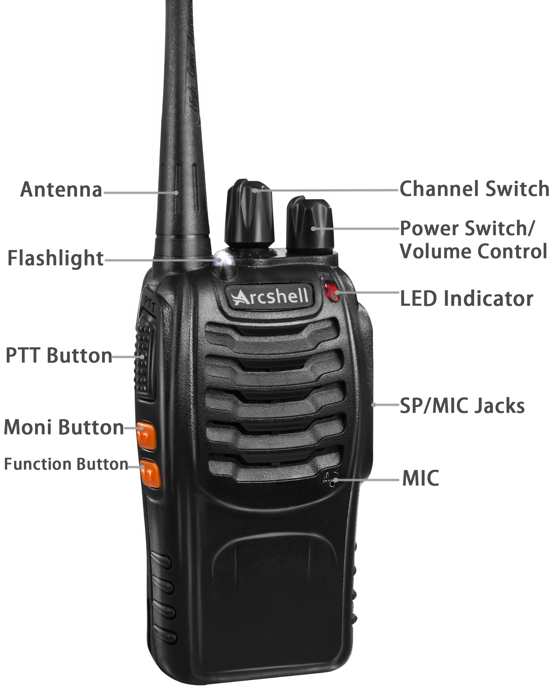

# 📡 Arcshell AR-5, BaoFeng BF-888S, Pxton PX 888s Guide

> **The definitive, beginner's resource for the world's most popular budget UHF radios.**

---

## 🚀 View the Full Guide

Our comprehensive documentation, including programming tutorials, legal information, and frequency charts, is now available at:

### 👉 **[https://sharf-shawon.github.io/arcshell-ar5-baofeng-bf-888s/](https://sharf-shawon.github.io/arcshell-ar5-baofeng-bf-888s/)**

---

## ⭐ Star This Repo

If you found this guide helpful, please **star the repository**! It helps others find this resource and builds social proof for the project.

---

## 🛠️ What's Inside?

- **Quick Start:** From unboxing to listening in 5 minutes.
- **Programming:** Step-by-step CHIRP tutorials for all skill levels.
- **Factory Defaults:** Lost your backup? Download original `.img` files here.
- **Legal Guide:** Clear, concise info on FCC regulations and Ham licensing.
- **Troubleshooting:** Solutions for common "cable not recognized" and transmission issues.

---

## 🤝 Contributing

Contributions are welcome! Please see [CONTRIBUTING.md](CONTRIBUTING.md) for guidelines on how to report errors or add new content.

---

## ⚖️ License

This project is distributed under the **Apache 2.0 License**. See [LICENSE](LICENSE) for more information.
